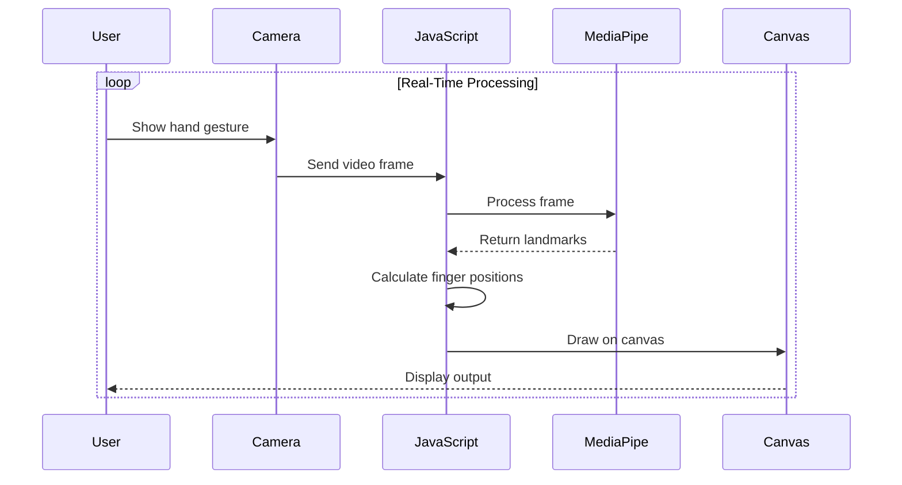

<h1 style="margin:0;">
  
 FingerVision — Real-Time Hand Tracking
  
</h1>


<p align="center">
  <b>A futuristic web-based hand tracking system powered by AI</b><br>
  Detect fingers • Track motion • Draw in air — all from your webcam
</p>

---

## 🎬 Live Demo

👉 https://8ernity.github.io/finger-vision/

---

##  
<h2 style="margin:0;">
  
  What is FingerVision?
</h2>

FingerVision is a **real-time hand tracking web app** that uses computer vision to detect and track your fingers through a webcam.

It allows you to:

* Interact with your screen using gestures
* Track fingertip positions
* Draw in the air like magic ✨

---

<h2 style="margin:0;">
  
  Features
</h2>


* 🖐 **Real-time Hand Tracking** using MediaPipe
* 🔢 **Finger Counting** (supports both hands)
* 🎯 **Fingertip Coordinate Tracking**
* ✏️ **Air Drawing Mode**
* 🧭 **Left & Right Hand Detection**
* 🎨 **Futuristic UI Design**
* ⚡ **Ultra-smooth real-time performance**

---

<h2 style="margin:0;">
  
  Tech Stack
</h2>


| Technology      | Purpose             |
| --------------- | ------------------- |
| HTML5           | Structure           |
| CSS3            | UI & Animations     |
| JavaScript      | Logic & Interaction |
| MediaPipe Hands | AI Hand Tracking    |

---

## 🏛️ System Architecture



## ⚙️ How It Works


1. Webcam captures live video
2. MediaPipe detects hand landmarks (21 key points)
3. JavaScript processes coordinates
4. UI renders tracking + drawing in real-time

---

<h2 style="margin:0;">
  
  Run Locally
</h2>


```bash
git clone https://github.com/8ernity/finger-vision.git
cd finger-vision
```

Then open `index.html` in your browser.

---

<h2 style="margin:0;">
  
  Use Cases
</h2>


* Gesture-based UI interaction
* Virtual drawing / teaching tools
* AR/VR experimentation
* Computer vision learning projects

---

## 🔮 Future Enhancements

* 🤖 AI gesture commands (click, scroll, zoom)
* 🎮 Gesture-controlled games
* 🧠 ML-based gesture recognition
* 📱 Mobile optimization

---

## 📜 License

MIT License — free to use and modify.

---

<p align="center">
  Built with ❤️ using Computer Vision
</p>
